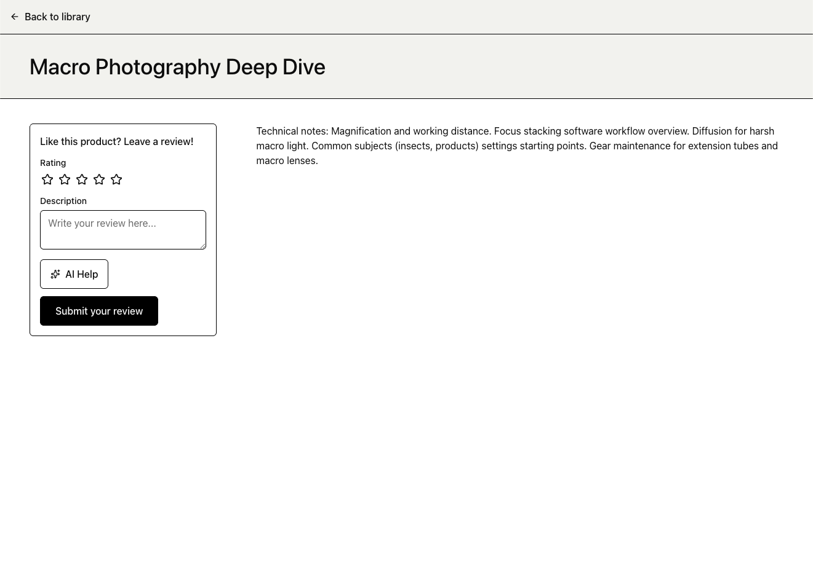
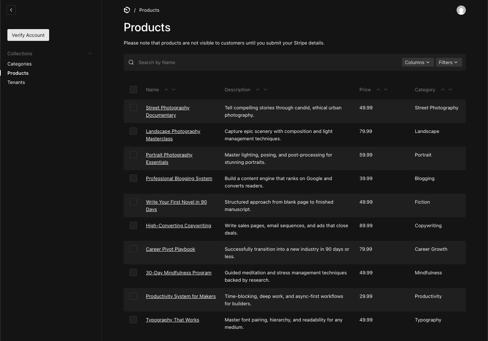

# Claro

A multi-tenant digital product marketplace built with Next.js 15, Payload CMS 3, and Stripe Connect. Creators get an independent storefront to sell courses, templates, and digital downloads. Customers get a personal library with protected content, ratings, and AI-assisted reviews.

---

## Screenshots

### Marketplace (filters & browse)


### Product Page


### Review Form With AI Helper



### Tenant admin



---

## Tech Stack

| Layer          | Technology                                   |
| -------------- | -------------------------------------------- |
| Framework      | Next.js 15 (App Router, Server Components)   |
| CMS / Database | Payload CMS 3 + MongoDB                      |
| API            | tRPC v11 + TanStack Query v5                 |
| Payments       | Stripe Connect (Express accounts)            |
| AI             | Anthropic Claude Haiku (structured tool use) |
| Auth           | Payload built-in (session, HTTP-only cookie) |
| UI             | Tailwind CSS 4 + shadcn/ui + Radix UI        |
| State          | Zustand (cart) + Nuqs (URL params)           |
| Storage        | Vercel Blob (media uploads)                  |
| Validation     | Zod (runtime boundaries + env schema)        |
| Language       | TypeScript (strict mode)                     |

---

## Features

**Marketplace**

- Hierarchical category browsing (parent → subcategories)
- Product filtering by price range, tags, category, and search
- Sorting by newest, trending (review count), and bestsellers (order count)
- Cursor-based infinite pagination

**Multi-Tenant Storefronts**

- Each creator gets a dedicated storefront at `/tenants/[slug]`
- Feature-flagged subdomain routing (`[slug].domain.com`) via Next.js middleware
- Products scoped to tenant via Payload multi-tenant plugin
- Private products hidden from global marketplace discovery

**Checkout & Payments**

- Stripe Checkout Sessions routed to creator's Connect account
- Platform fee deducted as `application_fee_amount`
- Webhook handler creates orders idempotently (deduplication by `stripeCheckoutSessionId`)
- Creator onboarding via Stripe Express account link

**Library & Content**

- Purchased products unlock protected rich-text content
- Content rendered with Payload's Lexical editor (`@payloadcms/richtext-lexical`)
- Purchase verification enforced server-side before content is served

**Reviews**

- 5-star rating + text review, one per user per product (compound unique index)
- Purchase required before reviewing (enforced in tRPC procedure)
- Review and order counts auto-maintained on products via Payload hooks
- AI-powered review draft generation (feature flag: `NEXT_PUBLIC_FEATURE_AI_REVIEW_HELPER`)

**AI Review Helper**

- Claude Haiku generates a suggested `{rating, description}` from product context
- Structured output via Anthropic tool use API — no prompt parsing
- Output validated with Zod before returning to client
- User confirms or cancels before applying the draft

---

## Engineering Decisions

**Stripe Connect Express over standard Stripe** — KYC, identity verification, and payout compliance are Stripe's problem, not mine. Handling that directly would mean building compliance infrastructure before the product even has users.

**Payload CMS over a custom database layer** — I got an admin panel, media uploads, typed collections, and access control without writing any of it. The alternative was building all that myself, badly, in three times the time. Payload v3 is stable enough that the coupling is worth it.

**Feature flags over separate deployments** — subdomain routing and the AI review helper are toggled via environment variables. Deploying code for a feature I'm still testing against real traffic isn't something I want to deal with. Flags let me keep both behaviours in the same build and switch without touching the code.

**Denormalised `reviewCount` / `orderCount` on Products** — trending and bestseller sorting hit every marketplace request. A `COUNT(*)` join per page load is the kind of thing that looks fine in development and causes problems at any real volume. Payload hooks keep the counters current on every order and review change, so sorting is just reading an indexed field.

**Idempotent webhook handler** — Stripe retries failed webhook deliveries. Without deduplication, a timeout during order creation means the customer gets charged and ends up with a duplicate order in the database. The handler checks `stripeCheckoutSessionId` uniqueness before inserting, so retries are harmless.

**AI output via tool use, not free text** — `tool_choice: { type: 'tool' }` forces the model to return `{rating, description}` in a defined schema every time. Parsing a star rating out of a paragraph of prose is a reliability problem I didn't want to own. The output still goes through Zod validation before it touches the client.

---

## Architecture

### Module Structure

Each domain lives in `src/modules/[name]/` and owns its tRPC router, UI components, hooks, types, and schemas. No cross-module data fetching — everything goes through tRPC procedures.

```
src/
├── app/                        # Next.js routes only — no business logic
├── collections/                # Payload CMS collection definitions (8 collections)
├── modules/
│   ├── auth/                   # Register, login, session
│   ├── products/               # Marketplace listing + filters
│   ├── checkout/               # Cart, Stripe Checkout session
│   ├── library/                # Purchased content access
│   ├── reviews/                # Ratings, CRUD, AI draft
│   │   ├── server/procedures.ts
│   │   ├── prompts.ts          # Claude prompt
│   │   ├── schemas.ts          # Zod schemas
│   │   └── types.ts
│   ├── categories/
│   ├── tags/
│   ├── tenants/
│   └── home/
├── lib/
│   ├── payload.ts              # Cached Payload singleton (globalThis)
│   ├── stripe.ts               # Stripe client
│   ├── lexical.ts              # Lexical ↔ plain text conversion, type guards
│   ├── access.ts               # isSuperAdmin() helper
│   └── utils.ts                # cn(), tenant URL generation
└── trpc/
    ├── init.ts                 # baseProcedure + protectedProcedure
    ├── routers/_app.ts         # Root router (8 sub-routers)
    ├── server.tsx              # Server-side caller + query client
    └── client.tsx              # Client-side provider
```

### Access Control

Payload collection-level access rules return either `true` (full access) or a `where` clause — functioning as row-level security without a separate middleware layer.

```typescript
// Tenant admins can only update their own products
update: ({ req: { user } }) => {
  if (isSuperAdmin(user)) return true;
  const tenantIds = user.tenants
    .map(({ tenant }) => typeof tenant === 'string' ? tenant : tenant?.id)
    .filter(Boolean);
  return { tenant: { in: tenantIds } };
},
```

### tRPC + Payload Integration

The tRPC context injects a cached Payload instance into every procedure. `protectedProcedure` verifies the session header before executing.

```typescript
// baseProcedure — Payload instance injected
baseProcedure.use(async ({ ctx, next }) => {
  const payload = await getPayloadCached();
  return next({ ctx: { ...ctx, payload } });
});

// protectedProcedure — requires valid session
protectedProcedure = baseProcedure.use(async ({ ctx, next }) => {
  const session = await ctx.payload.auth({ headers: ctx.headers });
  if (!session?.user) throw new TRPCError({ code: 'UNAUTHORIZED' });
  return next({ ctx: { ...ctx, session } });
});
```

### Stripe Webhook Handler

Located at `src/app/(app)/api/stripe/webhook/route.ts`. Handles two events:

- `checkout.session.completed` — creates an order, skips duplicates (idempotent by `stripeCheckoutSessionId`)
- `account.updated` — syncs `stripeDetailsSubmitted` on the tenant

Signature verified with `STRIPE_WEBHOOK_SECRET` before any processing.

### Environment Validation

`src/env.ts` validates all environment variables at startup using Zod. The app throws with a descriptive error before accepting any requests if configuration is missing or invalid.

Conditional refinements enforce that:

- `ANTHROPIC_API_KEY` is present when `NEXT_PUBLIC_FEATURE_AI_REVIEW_HELPER=true`
- `BLOB_READ_WRITE_TOKEN` is present in production
- `STRIPE_WEBHOOK_SECRET` is present in production

### Feature Flags

Two runtime flags control optional behaviour:

| Flag                                    | Default | Effect                                             |
| --------------------------------------- | ------- | -------------------------------------------------- |
| `NEXT_PUBLIC_FEATURE_SUBDOMAIN_ROUTING` | `false` | Enables `[slug].domain.com` via middleware rewrite |
| `NEXT_PUBLIC_FEATURE_AI_REVIEW_HELPER`  | `false` | Enables Claude-powered review suggestions          |

Both flags are checked on the client (to show/hide UI) and independently on the server (to guard the tRPC procedure). The server guard does not trust the client state.

---

## Data Model

```
Users ──< Tenants         (many-to-many via user.tenants[])
Tenants ──< Products      (one-to-many via multi-tenant plugin)
Products >── Categories   (many-to-one, hierarchical)
Products >─< Tags         (many-to-many)
Users ──< Orders >── Products
Users ──< Reviews >── Products  (unique compound index on user + product)
```

Auto-maintained counters: `reviewCount` and `orderCount` on Products are updated via Payload `afterChange` / `afterDelete` hooks on Reviews and Orders — no manual sync required.

---

## Getting Started

### Prerequisites

- Node.js 18.18+ (required by Next.js 15)
- MongoDB instance (local or Atlas)
- Stripe account with Connect enabled
- Anthropic API key (optional — only for AI review feature)

### Installation

```bash
git clone https://github.com/agakadela/claro.git
cd claro
npm install
```

### Environment Variables

```bash
cp .env.example .env
```

| Variable                                | Required      | Description                         |
| --------------------------------------- | ------------- | ----------------------------------- |
| `PAYLOAD_SECRET`                        | Yes           | Payload CMS secret key              |
| `DATABASE_URI`                          | Yes           | MongoDB connection string           |
| `STRIPE_SECRET_KEY`                     | Yes           | Stripe secret key                   |
| `STRIPE_WEBHOOK_SECRET`                 | Production    | Stripe webhook signature secret     |
| `NEXT_PUBLIC_APP_URL`                   | Yes           | Base URL (`http://localhost:3000`)  |
| `NEXT_PUBLIC_ROOT_DOMAIN`               | Yes           | Root domain for subdomain routing   |
| `BLOB_READ_WRITE_TOKEN`                 | Production    | Vercel Blob token for media uploads |
| `ANTHROPIC_API_KEY`                     | If AI enabled | Anthropic API key                   |
| `NEXT_PUBLIC_FEATURE_AI_REVIEW_HELPER`  | No            | `true` to enable AI review helper   |
| `NEXT_PUBLIC_FEATURE_SUBDOMAIN_ROUTING` | No            | `true` to enable subdomain routing  |

### Run

```bash
# Start development server
npm run dev

# Seed demo data
npm run db:seed

# Production build
npm run build && npm start
```

### Demo Accounts

After seeding:

| Role         | Email                       | Password        | Notes                                           |
| ------------ | --------------------------- | --------------- | ----------------------------------------------- |
| Super Admin  | `admin@demo.com`            | `Admin1234!`    | Full platform access via Payload admin panel    |
| Tenant Admin | `admin@knowledge-hub.com`   | `Admin1234!`    | Manages Knowledge Hub storefront and products   |
| Tenant Admin | `admin@creative-corner.com` | `Admin1234!`    | Manages Creative Corner storefront and products |
| Customer     | `alice@example.com`         | `Customer1234!` | Has purchase history and reviews                |
| Customer     | `bob@example.com`           | `Customer1234!` | Has purchase history and reviews                |
| Customer     | `carol@example.com`         | `Customer1234!` | Has purchase history and reviews                |
| Customer     | `david@example.com`         | `Customer1234!` | Has purchase history                            |
| Customer     | `eva@example.com`           | `Customer1234!` | Has purchase history                            |

The seed creates 2 tenants, 18 categories, 35+ products across both storefronts, purchase history across all customer accounts, and demo reviews with varied ratings to demonstrate trending and bestseller sorting.

> **AI Review Helper is disabled by default.** To enable it, set `NEXT_PUBLIC_FEATURE_AI_REVIEW_HELPER=true` and provide a valid `ANTHROPIC_API_KEY` in your `.env`.

---

## Known Limitations

- **Rate limiting** on `generateReviewDraft` is not implemented — an in-memory Map is NOOP in serverless environments. The correct solution is Upstash Redis as a distributed store, which is straightforward to add but out of scope for a portfolio project.
- **Subdomain routing** requires a DNS wildcard (`*.domain.com`) pointing to the same origin in production.
- **Media uploads** fall back to the local filesystem in development when `BLOB_READ_WRITE_TOKEN` is not set.
